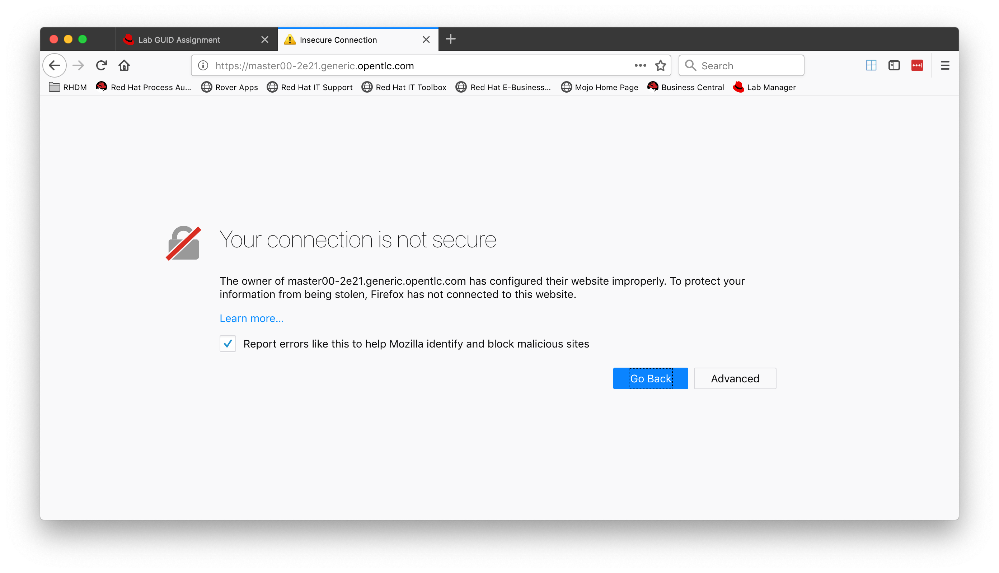
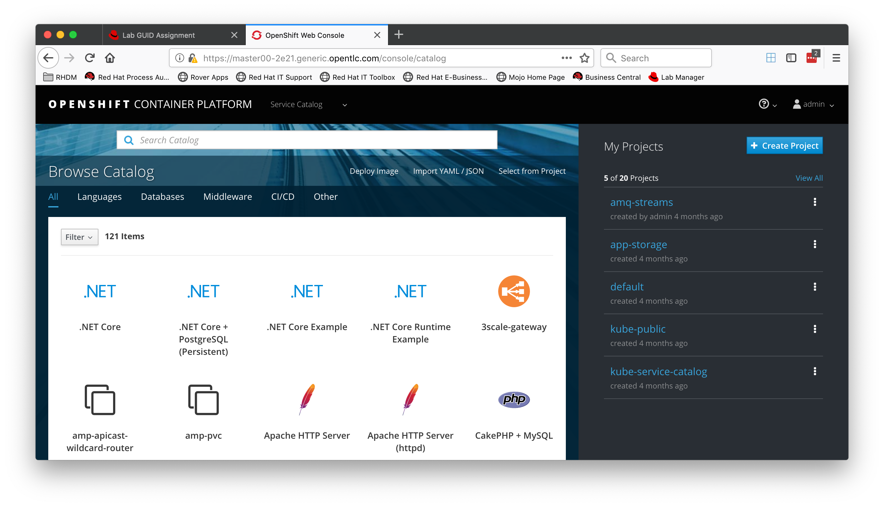

:source-highlighter: pygments

== AMQ Streams on OpenShift from 0 to 60

In this module you will learn how to install AMQ Streams on OpenShift.

=== Log into the OpenShift console

Your OpenShift cosole can be found at (replace "GUID" with your GUID of course): 
https://master00-GUID.generic.opentlc.com/console

You will see a warning message about the certificate which you can safely ignore.



Log into the console as the admin with user "admin" and the password supplied by your instructor



You should already have a project "amq-streams."  Click on the link, "amq-streams," and have a look around.  There shouldn't be much there yet though.

We will come back to the console throughout the lab.

=== AMQ Streams installation files

SSH into your workstation if you are not already in:

```bash

ssh -i ./msp.pem -vvv cloud-user@workstation-GUID.rhpds.opentlc.com

```

All the components necessary for installing AMQ Streams have been downloaded and extracted locally.
Once you log into the workstation machine, you should find a directory named `kafka`.
Let's navigate to the folder.

```bash

cd kafka

```

This directory contains three items:

* the unextracted zip file named `install_and_examples.zip`
* the contents of the zip file, as two folders: `install` and `examples`

[NOTE]
.Where does the zip file come from?
The installation files for AMQ Streams can be downloaded from link:https://access.redhat.com/node/3596931/423/1[this location].
You can find this information in the reference documentation https://access.redhat.com/documentation/en-us/red_hat_amq/7.2/html-single/using_amq_streams_on_openshift_container_platform/index#downloads-str[here].
The machines provisioned for the lab have downloaded and extracted this fine already.

Verify that this is the case by listing the contents of the directory.
Now we can start the lab.

=== Creating a new project for running the cluster operator

Log in as the administrator with the password supplied by the instructor.

```bash

oc login -u admin master00.example.com

```

A project named `amq-streams` should already exist and should be current for your user.
If it does not exist, you can create it.

```bash

oc new-project amq-streams

```

If it does already exist, be sure that it is the current project working on.

```bash

oc project amq-streams

```

=== Configuring the cluster operator and installing it

The configuration files for the cluster operator are available in the `install/cluster-operator` folder.
Let's take a quick look.

```bash

$ ls install/cluster-operator
010-ServiceAccount-strimzi-cluster-operator.yaml
020-ClusterRole-strimzi-cluster-operator-role.yaml
020-RoleBinding-strimzi-cluster-operator.yaml
021-ClusterRole-strimzi-cluster-operator-role.yaml
021-ClusterRoleBinding-strimzi-cluster-operator.yaml
030-ClusterRole-strimzi-kafka-broker.yaml
030-ClusterRoleBinding-strimzi-cluster-operator-kafka-broker-delegation.yaml
031-ClusterRole-strimzi-entity-operator.yaml
031-RoleBinding-strimzi-cluster-operator-entity-operator-delegation.yaml
032-ClusterRole-strimzi-topic-operator.yaml
032-RoleBinding-strimzi-cluster-operator-topic-operator-delegation.yaml
040-Crd-kafka.yaml
041-Crd-kafkaconnect.yaml
042-Crd-kafkaconnects2i.yaml
043-Crd-kafkatopic.yaml
044-Crd-kafkauser.yaml
045-Crd-kafkamirrormaker.yaml
050-Deployment-strimzi-cluster-operator.yaml

```

We will not get into details about the structure of the files, but, for now, it is important to understand that, taken together, they are the complete set of resources required to set up AMQ Streams on an OpenShift cluster.
The files include:

* service account
* cluster roles and and bindings
* a set of CRDs (Custom Resource Definitions) for the objects managed by the AMQ Streams cluster operator
* the cluster operator Deployment

Prior to installing the cluster operator, we will need to configure the namespaces it operates with.
We will do this by modifying the `*RoleBinding*.yaml` files to point to the newly created project `amq-streams`.
You can do this by simply editing all files via `sed`.

```

sed -i 's/namespace: .*/namespace: amq-streams/' install/cluster-operator/*RoleBinding*.yaml

```

Let's take a look at the result in one of the modified files:

```

more install/cluster-operator/020-RoleBinding-strimzi-cluster-operator.yaml

```bash

The output should look like this:

```yaml

apiVersion: rbac.authorization.k8s.io/v1beta1
kind: RoleBinding
metadata:
  name: strimzi-cluster-operator
  labels:
    app: strimzi
subjects:
- kind: ServiceAccount
  name: strimzi-cluster-operator
  namespace: amq-streams
roleRef:
  kind: ClusterRole
  name: strimzi-cluster-operator-namespaced
  apiGroup: rbac.authorization.k8s.io


```

Notice the `amq-streams` value configured for the `subjects.namespace` property.
You can check the other `*RoleBinding*.yaml` files for similar changes.

Now that the configuration files have been set, we can proceed with installing the cluster operator.

=== Installing the cluster operator

Once the configuration files are changed, you can install the cluster operator:

```bash

oc apply -f install/cluster-operator

```

For visualizing the result, log into the OpenShift console with the `admin` user.
Navigate to the `amq-streams` project and visualize the current deployments.
You should see the `strimzi-cluster-operator` running.
You have just deployed the cluster operator.

=== Creating an Apache Kafka cluster

It is time to start an Apache Kafka cluster.
We will create now the most basic cluster possible.
The configuration file is https://raw.githubusercontent.com/RedHatWorkshops/workshop-amq-streams/master/configurations/clusters/simple-cluster.yaml[here].
You can open it - it looks like this:

```yaml

apiVersion: kafka.strimzi.io/v1alpha1
kind: Kafka
metadata:
  name: simple-cluster
spec:
  kafka:
    replicas: 1
    listeners:
      plain: {}
      tls: {}
    config:
      offsets.topic.replication.factor: 1
      transaction.state.log.replication.factor: 1
      transaction.state.log.min.isr: 1
    storage:
      type: ephemeral
  zookeeper:
    replicas: 1
    storage:
      type: ephemeral
  entityOperator:
    topicOperator: {}
    userOperator: {}


```

Now let's create the cluster by deploying this new custom resource:

```bash

oc apply -f https://raw.githubusercontent.com/RedHatWorkshops/workshop-amq-streams/master/configurations/clusters/simple-cluster.yaml

```

Again, follow the deployment from the OpenShift console.
You should see three separate deployments:

* `simple-cluster-zookeeper` - a stateful set containing the Zookeeper ensemble
* `simple-cluster-kafka` - a stateful set containing the Kafka cluster
* `simple-cluster-entity-operator` - a deployment containing the entity operator for managing topics and users

=== Testing the deployment

Now, let's quickly test that the deployed Kafka cluster works.
Let's log into one of the cluster pods:

```bash

$ oc rsh simple-cluster-kafka-0

```

Next, let's start a producer:

```bash

$ bin/kafka-console-producer.sh --broker-list localhost:9092 --topic test-topic

```

Once the console producer is started, enter a few values:

```bash

> test
> test2

```


(Do not worry if you see the warnings below.
They are part of the interaction and indicate that the topic has not been found and broker will autocreate the `test-topic`.
The message `test` will be properly received by Kafka).

----
OpenJDK 64-Bit Server VM warning: If the number of processors is expected to increase from one, then you should configure the number of parallel GC threads appropriately using -XX:ParallelGCThreads=N
>test
[2019-02-05 15:32:46,828] WARN [Producer clientId=console-producer] Error while fetching metadata with correlation id 1 : {test-topic=LEADER_NOT_AVAILABLE} (org.apache.kafka.clients.NetworkClient)
[2019-02-05 15:32:46,939] WARN [Producer clientId=console-producer] Error while fetching metadata with correlation id 3 : {test-topic=LEADER_NOT_AVAILABLE} (org.apache.kafka.clients.NetworkClient)
>test2
----

Now let's open another terminal into the cluster pod in a separate terminal (open another `ssh` terminal into the workstation):

```bash

$ oc rsh simple-cluster-kafka-0

```

And let's start a consumer:

```bash

bin/kafka-console-consumer.sh --bootstrap-server localhost:9092 --topic test-topic --from-beginning

```

Once the consumer is started, you should see the previously sent messages in the output.
Reverting to the terminal where we started the console producer and sending any new messages there will result in those messages being displayed in the consumer terminal.

Now let's stop both producer and consumer applications with `CTRL-C` and then exit from the terminal of both containers.

```bash

exit

```

=== Kafka clusters and Kafka resources

The Kafka resource we just created is a representation of the running Kafka cluster.
You can use it to inspect and modify the current cluster configuration.
For example:

```bash

oc get kafka simple-cluster -o yaml

```


Will yield a detailed representation of the resource on the cluster:

```yaml

apiVersion: kafka.strimzi.io/v1alpha1
kind: Kafka
metadata:
  annotations:
    kubectl.kubernetes.io/last-applied-configuration: |
      {"apiVersion":"kafka.strimzi.io/v1alpha1","kind":"Kafka","metadata":{"annotations":{},"name":"simple-cluster","namespace":"amq-streams"},"spec":{"entityOperator":{"topicOperator":{},"userOperator":{}},"kafka":{"config":{"offsets.topic.replication.factor":1,"transaction.state.log.min.isr":1,"transaction.state.log.replication.factor":1},"listeners":{"plain":{},"tls":{}},"replicas":1,"storage":{"type":"ephemeral"}},"zookeeper":{"replicas":1,"storage":{"type":"ephemeral"}}}}
  creationTimestamp: 2019-02-05T15:27:11Z
  generation: 1
  name: simple-cluster
  namespace: amq-streams
  resourceVersion: "136009"
  selfLink: /apis/kafka.strimzi.io/v1alpha1/namespaces/amq-streams/kafkas/simple-cluster
  uid: 81e3ddbe-295a-11e9-bbf1-2cabcdef0010
spec:
  entityOperator:
    topicOperator: {}
    userOperator: {}
  kafka:
    config:
      offsets.topic.replication.factor: 1
      transaction.state.log.min.isr: 1
      transaction.state.log.replication.factor: 1
    listeners:
      plain: {}
      tls: {}
    replicas: 1
    storage:
      type: ephemeral
  zookeeper:
    replicas: 1
    storage:
      type: ephemeral

```

Finally, let's delete the Kafka cluster.
We will replace it with a configuration that is more appropriate for real world use cases.

```bash

oc delete kafka simple-cluster

```

=== Conclusion

In this workshop module, you have:

* Configured and Installed AMQ Streams
* Deployed a simple Kafka cluster
* Run a producer and consumer to validate the settings
