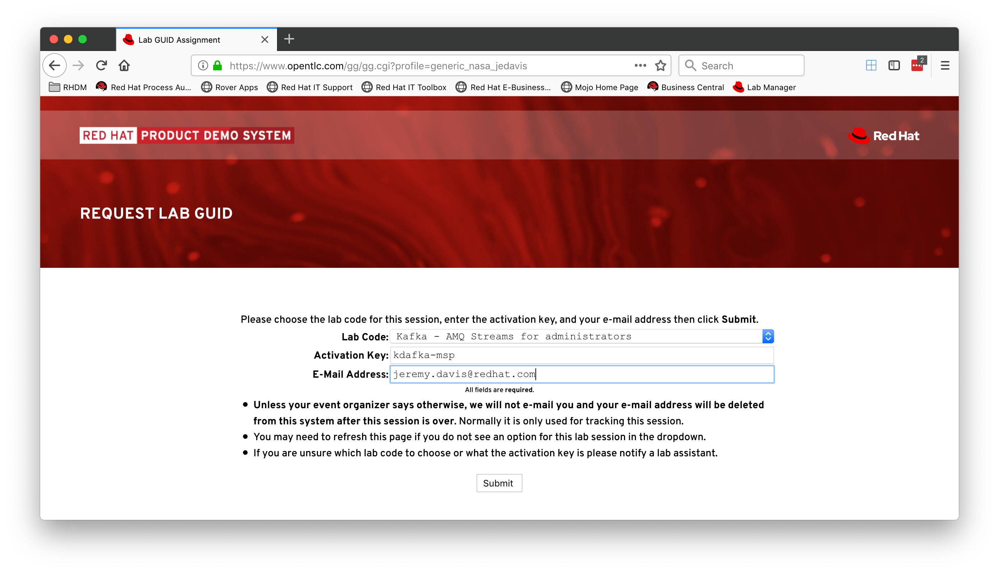
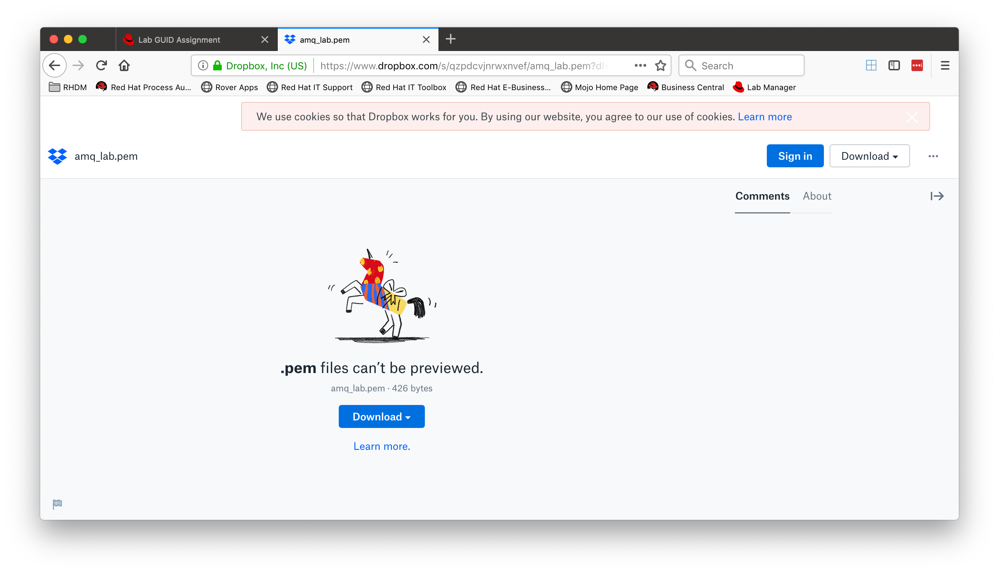

# Getting Started

Open the following url in your browser and fill out the form with the activation code, "kdafka-msp," and your email address (we won't spam you.)



link:images/getting-started-01.png[]

After you submit you will be taken to a confirmation page with a GUID.  You need this GUID for the lab so copy it down!


Download the key file from Dropbox

* pem for use with Mac or Linux: http://bit.ly/2LYZnYX
* ppk for use with Putty: http://bit.ly/2YGNpV614



SSH into your workstation

```shell

ssh -i ./msp.pem -vvv cloud-user@workstation-GUID.rhpds.opentlc.com

```

You are ready to go!

[Instructions](README.adoc)